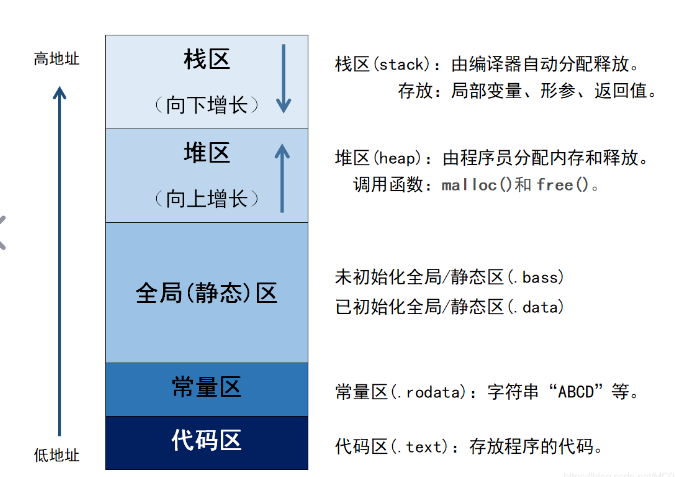
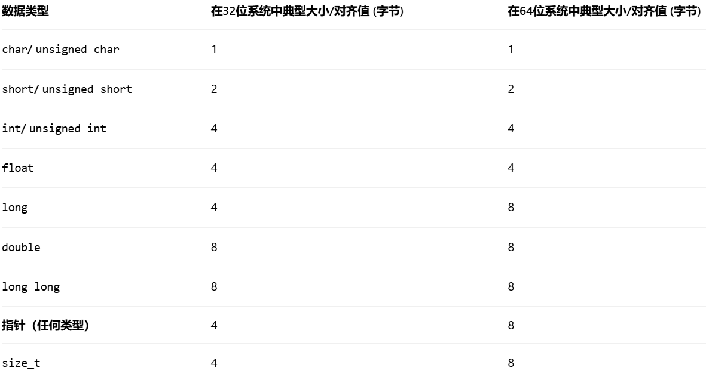
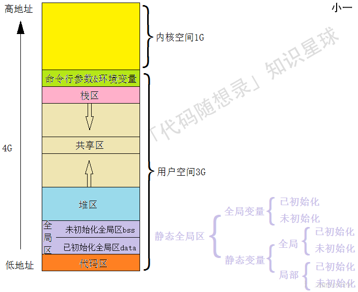

### C++内存分区

- 栈区：存储函数的局部变量、函数参数和函数调用信息的区域，管理函数的调用和返回，若函数无限递归会使栈溢出
- 堆区：存储动态分配的内存，手动分配和释放。
- 全局（静态）区：存储全局变量和静态变量。生命周期是整个程序运行时间。
- 常量区：也被称为只读区，存储常量数据，如字符串常量。
- 代码区：存储程序代码

### 内存泄漏：
1. 堆内存泄漏：申请内存后没有释放
2. 系统资源泄漏：程序使用系统分配的资源比如 Bitmap,handle ,SOCKET 等没有使用相应的函数释放掉，导致系统资源的浪费，严重可导致系统效能降低，系统运行不稳定。
3. 没有将基类的析构函数定义为虚函数：当基类指针指向子类对象时，如果基类的析构函数不是 virtual，那么子类的析构函数将不会被调用，子类的资源没有正确是释放，因此造成内存泄露。

### 野指针和悬空指针
1. 野指针：指针指向了不可预测的内存区域，常见原因：
   - 未初始化
   - 越界访问
   - 指针被非法修改
2. 悬空指针：指针原本指向一块有效内存，但这块内存已被释放或生命周期结束，指针仍然保存着原地址。

### 内存对齐
#### 内存对齐的原因：硬件平台限制和提升访问效率
- 硬件平台限制：并非所有硬件平台都能随意访问任意地址的数据。有些CPU（如某些早期的ARM处理器）根本无法访问未对齐的数据，尝试这么做会直接触发硬件异常，导致程序崩溃。而对x86/x64架构，虽然支持未对齐访问，但需要额外的内部操作，将多次内存访问的结果拼接起来，效率较低；
- 提升访问效率：现代计算机虽然按照字节编址，但**处理器访问内存时，通常以“字”（word）或“缓存行”（cache line，通常为64字节）为单位进行**。如果数据恰好对齐在合适的地址上，CPU一次访问就能读取完整数据。如果数据未对齐，可能会横跨两个访问单元，迫使CPU进行两次或更多次内存访问，然后进行复杂的位移和合并操作，这会显著降低性能

#### 结构体对齐详解：
1. 成员变量对齐：结构体第一个数据成员放在偏移量（offset）为0的地方。之后每个成员变量的起始偏移量，必须是 min(#pragma pack(n) )指定的数值, 该成员自身大小)​ 的整数倍。编译器会在必要时于成员之间插入填充字节（padding）来满足此要求。
   
2. 结构体整体对齐：在所有成员都对齐之后，结构体本身的总大小必须是 min(#pragma pack(n) 指定的数值, **结构体中最宽成员的大小**)​ 的整数倍。编译器会在最后一个成员之后添加填充字节以满足此条件。

3. 编译器默认对齐：如果没有使用 #pragma pack指定，则使用编译器的默认对齐模数（如Visual Studio通常为8，GCC通常为4）

4. 通过简单地按照成员类型大小降序排列（将大的类型如 int放在前面，小的类型如 char放在后面），可以显著减少填充字节，优化内存空间

#### 控制与验证对齐
1. 修改对齐方式：可以使用预编译指令 #pragma pack(n)来修改对齐系数，这在处理网络数据包或硬件寄存器映射等需要精确控制内存布局的场景中非常有用。C++11标准引入了 alignas说明符，可以更精细地指定变量或类型的对齐要求。

2. 动态内存对齐：使用 malloc分配的内存通常只保证与最宽基础类型对齐。对于需要更高对齐要求的内存（如用于SSE指令的 __m128类型），应使用专用的对齐内存分配函数，如 aligned_alloc（C11/C++17）或平台特定的 _aligned_malloc。

3. 验证对齐：可以使用 offsetof宏来查看结构体成员的偏移量，使用 alignof（C++11）或 _Alignof（C11）来查询类型的对齐要求，这有助于调试和确保对齐符合预期。

#### 编译器对常见类型的对齐字节：

### 对齐规则：
- 数据成员对齐规则：结构体或联合的每个成员，其起始内存地址必须是 该成员自身大小​ 与 编译器当前指定的对齐系数（通过 #pragma pack(n)设置）中较小的那个值的整数倍。编译器会在成员之间自动插入填充字节来满足这一要求
- 整体对齐规则：在所有数据成员都对齐之后，整个结构体或联合本身的大小，必须是 其最宽成员类型的大小​ 与 编译器当前指定的对齐系数​ 中较小的那个值的整数倍。因此，编译器可能会在最后一个成员之后额外添加填充字节
- 控制对齐的方式：你可以使用预编译指令 #pragma pack来干预编译器的对齐行为：

    - #pragma pack(n)：设置新的对齐系数，n通常为 1、2、4、8、16

    - #pragma pack()：恢复默认的对齐设置

    - #pragma pack(push, n)和 #pragma pack(pop)：更推荐的方式，用于保存当前对齐状态、设置新对齐，然后恢复先前状态，避免影响其他代码模块

### 进程的地址空间分布

- 命令行参数和环境变量是指从命令行执行程序的时候，给程序的参数

### new和delete的错误使用方法：
new[]与delete结合使用的问题：
1. 内存泄漏，只会释放数组中的第一个元素的内存
2. 段错误，程序崩溃，数组分配的内存空间的起始地址在数组首地址之前的4个字节处，这多出来的4个字节用于存储数组的长度信息，释放时应该传入内存空间的首地址而不是数组首地址。