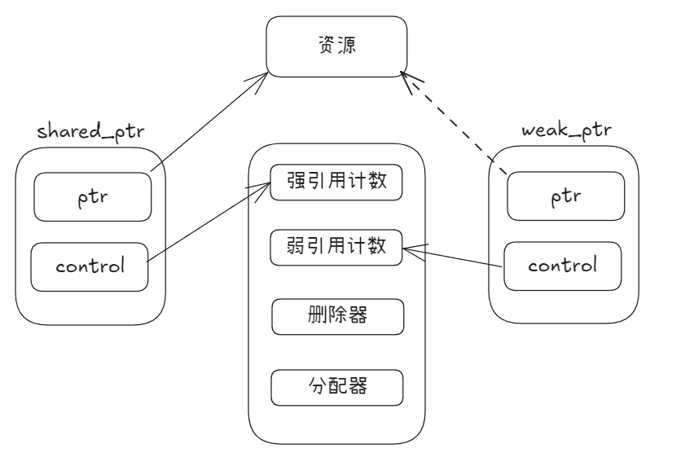

### 智能指针介绍
智能指针是一种自动管理动态内存的工具类，用于防止内存泄漏。C++提供了三种智能指针：
- unique_ptr: **独占所有权**，指向的对象只能有当前这个指针指向。禁止拷贝构造和拷贝赋值，支持移动语义。
- shared_ptr: 共享所有权，使用**引用计数**，当对象之间进行复制或者赋值的时候，引用计数会加+1，当最后一个对象销毁的时候，引用计数减为0，此时会回收托管的空间。
- weak_ptr: 弱指针，不拥有资源，用于防止**循环引用**，相当于一个观察者。如果对象在指针还在时被释放，也不会报错，不受影响。

#### shared_ptr循环引用问题：
当两个或多个对象通过 shared_ptr相互持有对方，形成一个引用环时，就会导致它们的引用计数永远无法降为零，从而无法被自动销毁，造成内存泄漏


### 所有权代码示例说明
- unique_ptr:
```
#include <memory>
std::unique_ptr<int> ptr1(new int(10));
// std::unique_ptr<int> ptr2 = ptr1.  //错误，不可拷贝
std::unique_ptr<int> ptr2 = std::move(ptr1); //正确
```
- shared_ptr:
```
#include <memory>
std::shared_ptr<int> p1 = std::make_shared<int>(10);
std::shared_ptr<int> p2 = p1;  // 引用计数 +1
```
- weak_ptr:
```
std::shared_ptr<int> sp = std::make_shared<int>(42);
std::weak_ptr<int> wp = sp;  // 不增加引用计数
```

### 创建示例代码说明
- unique_ptr:
```
// 推荐方式：使用 std::make_unique（C++14引入）
auto ptr1 = std::make_unique<int>(42);
// 传统方式：直接构造（不推荐，有异常安全风险）
std::unique_ptr<int> ptr2(new int(100));
```
- shared_ptr:
```
auto shared1 = std::make_shared<std::string>("Shared World");
std::shared_ptr<std::string> shared2 = shared1; // 引用计数变为 2
std::cout << "Use count: " << shared1.use_count() << std::endl; // 输出 2
```
- weak_ptr:
```
// 通过shared_ptr或weak_ptr构造
std::weak_ptr<T> wp2(sp);
// 通过weak_ptr赋值
wp1 = wp3;
```

### 高级用法
unique_ptr的数组特化版本：
```
std::unique_ptr<int[]> arrPtr(new int[10]{});
arrPtr[0] = 100; // 支持下标操作
```

unique_ptr自定义删除器: 扩展unique_ptr的管辖范围，使其不再局限于 new/delete管理的内存，而是能管理任何具有明确生命周期的资源。unique_ptr的删除器是类型的一部分，在编译期绑定，主要有三种方式来自定义删除器：**函数对象、函数指针和 Lambda 表达式**
```
// 示例1：使用函数对象（Functor）作为删除器
struct FileCloser {
    void operator()(std::FILE* fp) const {
        if (fp) {
            std::fclose(fp);
            std::cout << "File closed via functor.\n";
        }
    }
};

// 示例2：使用函数指针作为删除器
void MyArrayDeleter(int* ptr) {
    delete [] ptr;
    std::cout << "int[] freed via function pointer.\n";
}

// 示例3：使用 Lambda 表达式作为删除器 (推荐)
auto mutex_deleter = [](std::mutex* mtx) { 
    mtx->unlock(); 
    delete mtx;
    std::cout << "Mutex unlocked and deleted via lambda.\n";
};

int main() {
    // 1. 管理文件句柄 (避免使用默认的 delete)
    std::unique_ptr<std::FILE, FileCloser> filePtr(std::fopen("test.txt", "w"));
    // 离开作用域时自动调用 FileCloser::operator()，即 fclose

    // 2. 管理动态数组 (替代 std::unique_ptr<T[]>)
    std::unique_ptr<int[], decltype(&MyArrayDeleter)> arrPtr(new int[100], MyArrayDeleter);
    // 使用 decltype 获取函数指针类型，即void(*)(int*)

    // 3. 管理互斥锁（利用 Lambda 捕获能力记录日志）
    std::string log_msg = "CustomMutex";
    auto logger_deleter = [log_msg](std::mutex* mtx) { 
        mtx->unlock();
        delete mtx; 
        std::cout << log_msg << " handled.\n";
    };
    std::unique_ptr<std::mutex, decltype(logger_deleter)> mtxPtr(new std::mutex, logger_deleter);

    return 0;
}
```

shared_ptr自定义删除器：std::shared_ptr的删除器在构造函数中传递，不是类型的一部分，因此更加灵活。任何可调用对象，只要**签名与void (T*)兼容**，都可以作为其删除器。这种设计使得**管理相同资源但需要不同释放方式的shared_ptr属于同一类型**，可以放入同一容器或相互赋值，shared_ptr的删除器在运行时绑定，有运行时开销
```
// 1. 使用Lambda表达式
std::shared_ptr<FILE> sp1(std::fopen("data.txt", "r"), [](FILE* fp) {
    if (fp) std::fclose(fp);
});

// 2. 使用函数指针
void customFileDeleter(FILE* fp) { ... }
std::shared_ptr<FILE> sp2(std::fopen("data.txt", "r"), customFileDeleter);

// 3. 使用函数对象
struct FileDeleter { ... };
std::shared_ptr<FILE> sp3(std::fopen("data.txt", "r"), FileDeleter{});

// 用法示例

std::shared_ptr<int> arrayPtr(new int[10], [](int* p) { delete[] p; });
// 对于std::unique_ptr，它有对数组的特化版本，使用更简单：
std::unique_ptr<int[]> arrayUniquePtr(new int[10]); // 默认使用delete[]

std::shared_ptr<FILE> file(std::fopen("data.txt", "r"), std::fclose);
```

shared_ptr别名构造：即一个新的 shared_ptr可以与另一个 shared_ptr共享所有权和控制块（引用计数增加），但指向的却是另一个不同的对象（通常是原对象的一个成员）
```
struct MyStruct { int very_important_data; };
auto ptr_struct = std::make_shared<MyStruct>();
// alias_ptr 共享 ptr_struct 的所有权，但指向其内部的成员
std::shared_ptr<int> alias_ptr(ptr_struct, &ptr_struct->very_important_data);
```

### 底层实现原理
- unique_ptr：底层存储结构为单个裸指针，指示删除了拷贝构造和赋值功能，只允许移动语义。因此近乎零开销；
- shared_ptr与weak_ptr：控制块 + 原子引用计数，两者底层存储结构相同，都由一个指向对象（占用内存资源）的指针和一个指向控制块的指针组成。控制块与对象资源解耦，控制块由强引用计数、弱引用计数、删除器、分配器四个组件组成，当强引用计数为0时，对象资源被释放，但是控制块还存在；当强引用和弱引用计数都为0时，才会删除控制块。
- 
