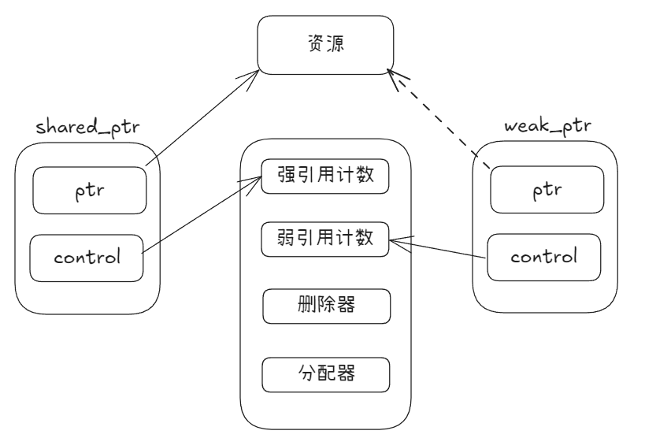

### 智能指针介绍
智能指针是一种自动管理动态内存的工具类，用于防止内存泄漏。C++提供了三种智能指针：
- unique_ptr: **独占所有权**，指向的对象只能有当前这个指针指向。禁止拷贝构造和拷贝赋值，支持移动语义。
- shared_ptr: 共享所有权，使用**引用计数**，当对象之间进行复制或者赋值的时候，引用计数会加+1，当最后一个对象销毁的时候，引用计数减为0，此时会回收托管的空间。
- weak_ptr: 弱指针，不拥有资源，用于防止**循环引用**，相当于一个观察者。如果对象在指针还在时被释放，也不会报错，不受影响。

#### shared_ptr循环引用问题：
当两个或多个对象通过 shared_ptr相互持有对方，形成一个引用环时，就会导致它们的引用计数永远无法降为零，从而无法被自动销毁，造成内存泄漏。

#### shared_ptr自引用：
在某些情况下，shared_ptr可能需要自我引用以延长生命周期（例如一个对象将自己注册到其内部的一个回调函数或事件监听器中），但是当无外部引用时，自引用也是一个循环引用，也会造成内存泄漏

#### 如何解决shared_ptr的循环引用问题？
1. 使用weak_ptr，见下文
2. 手动管理，在明确知晓生命周期的情况下，使用reset()手动断开引用

### 所有权代码示例说明
- unique_ptr:
```
#include <memory>
std::unique_ptr<int> ptr1(new int(10));
// std::unique_ptr<int> ptr2 = ptr1.  //错误，不可拷贝
std::unique_ptr<int> ptr2 = std::move(ptr1); //正确
```
- shared_ptr:
```
#include <memory>
std::shared_ptr<int> p1 = std::make_shared<int>(10);
std::shared_ptr<int> p2 = p1;  // 引用计数 +1
```
- weak_ptr:
```
std::shared_ptr<int> sp = std::make_shared<int>(42);
std::weak_ptr<int> wp = sp;  // 不增加引用计数
```

### 创建示例代码说明
- unique_ptr:
```
// 推荐方式：使用 std::make_unique（C++14引入）
auto ptr1 = std::make_unique<int>(42);
// 传统方式：直接构造（不推荐，有异常安全风险）
std::unique_ptr<int> ptr2(new int(100));
```
- shared_ptr:
```
auto shared1 = std::make_shared<std::string>("Shared World");
std::shared_ptr<std::string> shared2 = shared1; // 引用计数变为 2
std::cout << "Use count: " << shared1.use_count() << std::endl; // 输出 2
```
- weak_ptr:
```
// 通过shared_ptr或weak_ptr构造
std::weak_ptr<T> wp2(sp);
// 通过weak_ptr赋值
wp1 = wp3;
```

### 高级用法
unique_ptr的数组特化版本：
```
std::unique_ptr<int[]> arrPtr(new int[10]{});
arrPtr[0] = 100; // 支持下标操作
```

unique_ptr自定义删除器: 扩展unique_ptr的管辖范围，使其不再局限于 new/delete管理的内存，而是能管理任何具有明确生命周期的资源。unique_ptr的删除器是类型的一部分，在编译期绑定，主要有三种方式来自定义删除器：**函数对象、函数指针和 Lambda 表达式**
```
// 示例1：使用函数对象（Functor）作为删除器
struct FileCloser {
    void operator()(std::FILE* fp) const {
        if (fp) {
            std::fclose(fp);
            std::cout << "File closed via functor.\n";
        }
    }
};

// 示例2：使用函数指针作为删除器
void MyArrayDeleter(int* ptr) {
    delete [] ptr;
    std::cout << "int[] freed via function pointer.\n";
}

// 示例3：使用 Lambda 表达式作为删除器 (推荐)
auto mutex_deleter = [](std::mutex* mtx) { 
    mtx->unlock(); 
    delete mtx;
    std::cout << "Mutex unlocked and deleted via lambda.\n";
};

int main() {
    // 1. 管理文件句柄 (避免使用默认的 delete)
    std::unique_ptr<std::FILE, FileCloser> filePtr(std::fopen("test.txt", "w"));
    // 离开作用域时自动调用 FileCloser::operator()，即 fclose

    // 2. 管理动态数组 (替代 std::unique_ptr<T[]>)
    std::unique_ptr<int[], decltype(&MyArrayDeleter)> arrPtr(new int[100], MyArrayDeleter);
    // 使用 decltype 获取函数指针类型，即void(*)(int*)

    // 3. 管理互斥锁（利用 Lambda 捕获能力记录日志）
    std::string log_msg = "CustomMutex";
    auto logger_deleter = [log_msg](std::mutex* mtx) { 
        mtx->unlock();
        delete mtx; 
        std::cout << log_msg << " handled.\n";
    };
    std::unique_ptr<std::mutex, decltype(logger_deleter)> mtxPtr(new std::mutex, logger_deleter);

    return 0;
}
```

shared_ptr自定义删除器：std::shared_ptr的删除器在构造函数中传递，不是类型的一部分，因此更加灵活。任何可调用对象，只要**签名与void (T*)兼容**，都可以作为其删除器。这种设计使得**管理相同资源但需要不同释放方式的shared_ptr属于同一类型**，可以放入同一容器或相互赋值，shared_ptr的删除器在运行时绑定，有运行时开销
```
// 1. 使用Lambda表达式
std::shared_ptr<FILE> sp1(std::fopen("data.txt", "r"), [](FILE* fp) {
    if (fp) std::fclose(fp);
});

// 2. 使用函数指针
void customFileDeleter(FILE* fp) { ... }
std::shared_ptr<FILE> sp2(std::fopen("data.txt", "r"), customFileDeleter);

// 3. 使用函数对象
struct FileDeleter { ... };
std::shared_ptr<FILE> sp3(std::fopen("data.txt", "r"), FileDeleter{});

// 用法示例

std::shared_ptr<int> arrayPtr(new int[10], [](int* p) { delete[] p; });
// 对于std::unique_ptr，它有对数组的特化版本，使用更简单：
std::unique_ptr<int[]> arrayUniquePtr(new int[10]); // 默认使用delete[]

std::shared_ptr<FILE> file(std::fopen("data.txt", "r"), std::fclose);
```

shared_ptr别名构造：即一个新的 shared_ptr可以与另一个 shared_ptr共享所有权和控制块（引用计数增加），但指向的却是另一个不同的对象（通常是原对象的一个成员）
```
struct MyStruct { int very_important_data; };
auto ptr_struct = std::make_shared<MyStruct>();
// alias_ptr 共享 ptr_struct 的所有权，但指向其内部的成员
std::shared_ptr<int> alias_ptr(ptr_struct, &ptr_struct->very_important_data);
```

### 底层实现原理
- unique_ptr：底层存储结构为单个裸指针，指示删除了拷贝构造和赋值功能，只允许移动语义。因此近乎零开销；
- shared_ptr与weak_ptr：控制块 + 原子引用计数，两者底层存储结构相同，都由一个指向对象（占用内存资源）的指针和一个指向控制块的指针组成。控制块与对象资源解耦，控制块由强引用计数、弱引用计数、删除器、分配器四个组件组成，当强引用计数为0时，对象资源被释放，但是控制块还存在；当强引用和弱引用计数都为0时，才会删除控制块。
- 

### shared_ptr的不同初始化性能分析
- 直接使用 new：每次创建 shared_ptr 都会单独分配一个控制块和对象资源，共分配两次，内存分配开销较大。
- 使用 std::make_shared：一次性分配控制块和对象资源，只分配一次，内存分配开销较小，性能更好。

### 补充：智能指针的线程安全性
- unique_ptr：**不提供线程安全保证**，只能在单线程环境中使用，或者通过外部同步机制保护。
- shared_ptr：**提供线程安全的引用计数**，多个线程可以安全地共享同一个 shared_ptr实例，但**不保证对象本身的线程安全**，需要用户自行保证对托管对象的访问同步。
- weak_ptr：**提供线程安全的引用计数**，多个线程可以安全地共享同一个 weak_ptr实例，但同样不保证对象本身的线程安全。因此，在多线程环境中使用智能指针时，必须确保对托管对象的访问是线程安全的，通常需要配合互斥锁等同步机制来保护对对象的访问。

### 补充：一般而言，unique_ptr性能优于shared_ptr，因为它没有引用计数的开销。但在某些场景下，shared_ptr的性能可能更好，下面从这两个指针的底层实现原理开始分析：
- unique_ptr：底层存储结构为单个裸指针，指示删除了拷贝构造和赋值功能，只允许移动语义。因此近乎零开销；
- shared_ptr与weak_ptr：控制块 + 原子引用计数，两者底层存储结构相同，都由一个指向对象（占用内存资源）的指针和一个指向控制块的指针组成（共两个指针）。控制块与对象资源解耦，控制块由强引用计数、弱引用计数、删除器、分配器四个组件组成，当强引用计数为0时，对象资源被释放，但是控制块还存在；当强引用和弱引用计数都为0时，才会删除控制块。
1. 场景一：避免重复创建昂贵资源（数据库连接、线程、文件句柄等），使用共享代替重新创建，shared_ptr的引用计数开销相对于资源创建的开销来说是微不足道的，因此在这种场景下，shared_ptr的性能可能更好。
2. 场景二：多线程共享只读数据（生命周期管理的差异）：
   本场景的核心矛盾在于**如何保证一个线程在读取时，另一个控制流不会突然把这块内存释放掉（导致野指针）**。
   - **为什么 shared_ptr 不需要锁？（引用机制的魔法）**：`shared_ptr` 允许被拷贝。在创建子线程时，我们可以将 `shared_ptr` **按值传递（拷贝）**给每一个线程。此时底层的**原子引用计数**（Atomic Reference Count）发挥了核心作用：每个线程在此生命周期内都持有对此资源的“保留权”，只要还有任何一个线程正在运行，引用计数就绝对 $> 0$，底层的内存资源就绝对不会被其他外部操作意外释放。因此，多个线程可以做到**完全无锁、绝对安全地并发读取**同一份数据，大幅提升性能。
      > **补充理解：shared_ptr 的局部拷贝与全局控制块机制**
      > 很多时候容易误解“每个线程都有一个 shared_ptr，所以有多个不同的引用计数”。实际上：
      > 1. **共享唯一控制块**：不管通过拷贝产生了多少个 `shared_ptr` 对象（比如下发给4个子线程），它们指向的**底层数据资源**仅有一份，负责管理的**控制块（Control Block，其内含有引用计数）也永远只有一份**。
      > 2. **各自持有复印件，统一计分**：主线程下发任务时发生拷贝，每个子线程拿到的是一个“新的指针对象复印件”作为自己的局部变量，但这些复印件的内部全部连接到那个唯一的中央控制块。没拷贝一次，那个中央控制块里的计分板就原子性 `+1`。
      > 3. **局部销毁引发全局倒扣**：当某个子线程运行结束，它手中的局部 `shared_ptr` 发生析构，它会去敲控制块的门，将引用计数 `-1`。只有最后一个人（引用计数归 0）才会真正触发底层内存的 `delete`。
   - **为什么 unique_ptr 必须要锁？**：`unique_ptr` **独占所有权且无法被拷贝**。这意味着无论开多少个线程，系统中永远只能存在这唯一的那个指针，所有线程只能被迫“共享访问”这个唯一的全局/外部对象。这就意味着线程手里并没有该对象的生命周期保障：如果在此期间某个其他线程或主线程调用了 `uniqueData.reset()` 甚至触发了析构，正在读取的侧线程立刻就会面临**野指针崩溃**。为了防止在读取期间对象被外部不可控地“谋杀”，它只能在每次访问时使用互斥锁 `std::mutex` 把自己重重保护起来，反而造成了极高的性能开销。

示例代码如下：
```cpp
// --- 【shared_ptr 优势场景】：各个线程拿到共享拷贝，利用原子引用计数天然保障生命周期，无需加锁 ---
#include <memory>
#include <thread>
#include <vector>
#include <iostream>

void threadFuncVal(std::shared_ptr<std::vector<int>> sp) {
    // sp 是本线程的专属拷贝，引用计数增加了！在此局部变量失效前，任何人都不可能销毁真正的 vector
    for (int i = 0; i < 1000000; ++i) {
        int value = (*sp)[i]; // 绝对安全地无锁并发读取
    }
}

int main() {
    auto sharedData = std::make_shared<std::vector<int>>(1000000, 42);
    std::vector<std::thread> threads;
    for (int i = 0; i < 4; ++i) {
        // 关键点：按值传递 sharedData，触发拷贝构造
        threads.emplace_back(threadFuncVal, sharedData);
    }
    for (auto& t : threads) {
        t.join();
    }
    return 0;
}
```
```cpp
// --- 【unique_ptr 局限场景】：无法给线程传递拷贝，只能共享唯一实体，被迫全程加锁防释放 ---
#include <memory>
#include <thread>
#include <vector>
#include <iostream>
#include <mutex>

// 全局唯一的实例
std::unique_ptr<std::vector<int>> uniqueData = std::make_unique<std::vector<int>>(1000000, 42);
std::mutex mtx;

void threadFuncRef() {
    // 线程无法拿到该对象的所有权，仅仅是来“看一眼”，所以存在极其严重的生命周期风险
    for (int i = 0; i < 1000000; ++i) {
        std::lock_guard<std::mutex> lock(mtx); // 必须加锁：防止我读一半，主控流程突然把智能指针 reset/delete 掉！
        if (uniqueData) {
            int value = (*uniqueData)[i];
        }
    }
}

int main() {
    std::vector<std::thread> threads;
    for (int i = 0; i < 4; ++i) {
        threads.emplace_back(threadFuncRef);
    }
    for (auto& t : threads) {
        t.join();
    }
    return 0;
}
```

3. 场景三：计算结果共享与缓存：当多个线程需要共享一个计算结果或者缓存时，使用 shared_ptr 可以避免重复计算和资源浪费。虽然 shared_ptr 的引用计数会带来一些性能开销，但在这种场景下，避免重复计算的性能提升通常会远远超过引用计数的开销，因此 shared_ptr 可能表现更好。示例代码如下：
```cpp
// 计算缓存
class ExpensiveComputation {
    mutable std::shared_ptr<Result> cached_result;
    mutable std::mutex cache_mutex;
    
public:
    std::shared_ptr<Result> compute() const {
        std::lock_guard lock(cache_mutex);
        
        if (!cached_result) {
            // 昂贵计算
            cached_result = std::make_shared<Result>(do_expensive_computation());
        }
        
        return cached_result;  // 返回共享结果
    }
};
```

### 补充：auto_ptr
auto_ptr 是 C++98 标准引入的智能指针，提供了基本的自动内存管理功能，但存在一些严重的问题：
1. **所有权转移问题**：auto_ptr 在拷贝构造和赋值操作中会发生所有权转移，即当一个 auto_ptr 被拷贝时，原来的 auto_ptr 会失去对资源的所有权，变成空指针。这导致了潜在的内存泄漏和悬空指针问题。
2. **不支持数组**：auto_ptr 只能管理单个对象，无法管理动态分配的数组。
3. **不适合多线程环境**：由于所有权转移的特性，auto_ptr 在多线程环境中使用时会导致不可预测的行为。
由于这些问题，auto_ptr 在 C++11 标准中被废弃，建议使用 unique_ptr 或 shared_ptr 来替代 auto_ptr，以获得更安全和更可靠的内存管理。