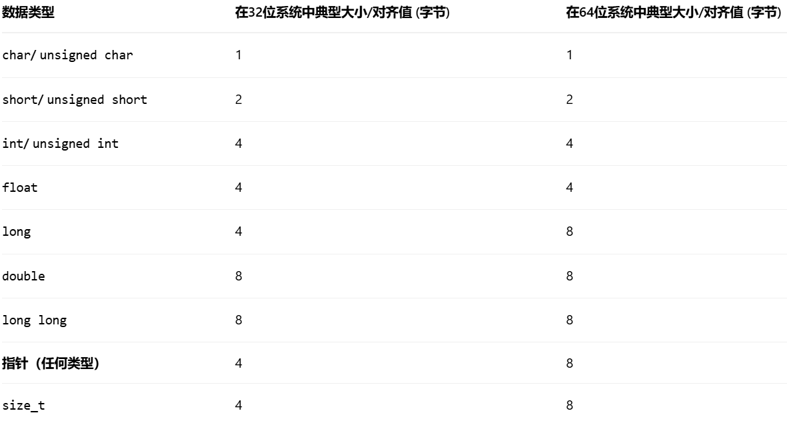
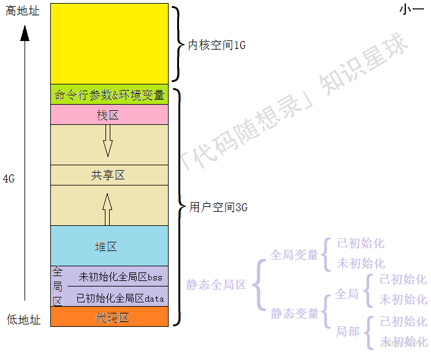

### C++内存分区

- 栈区：存储函数的局部变量、函数参数和函数调用信息的区域，管理函数的调用和返回，若函数无限递归会使栈溢出
- 堆区：存储动态分配的内存，手动分配和释放。
- 全局（静态）区：存储全局变量和静态变量。生命周期是整个程序运行时间。
- 常量区：也被称为只读区，存储常量数据，如字符串常量。
- 代码区：存储程序代码

### 内存泄漏：
1. 堆内存泄漏：申请内存后没有释放
2. 系统资源泄漏：程序使用系统分配的资源比如 Bitmap,handle ,SOCKET 等没有使用相应的函数释放掉，导致系统资源的浪费，严重可导致系统效能降低，系统运行不稳定。
3. 没有将基类的析构函数定义为虚函数：当基类指针指向子类对象时，如果基类的析构函数不是 virtual，那么子类的析构函数将不会被调用，子类的资源没有正确是释放，因此造成内存泄露。

### 野指针和悬空指针
1. 野指针：指针指向了不可预测的内存区域，常见原因：
   - 未初始化
   - 越界访问
   - 指针被非法修改
2. 悬空指针：指针原本指向一块有效内存，但这块内存已被释放或生命周期结束，指针仍然保存着原地址。

### 内存对齐
#### 内存对齐的原因：硬件平台限制和提升访问效率
- 硬件平台限制：并非所有硬件平台都能随意访问任意地址的数据。有些CPU（如某些早期的ARM处理器）根本无法访问未对齐的数据，尝试这么做会直接触发硬件异常，导致程序崩溃。而对x86/x64架构，虽然支持未对齐访问，但需要额外的内部操作，将多次内存访问的结果拼接起来，效率较低；
- 提升访问效率：现代计算机虽然按照字节编址，但**处理器访问内存时，通常以“字”（word）或“缓存行”（cache line，通常为64字节）为单位进行**。如果数据恰好对齐在合适的地址上，CPU一次访问就能读取完整数据。如果数据未对齐，可能会横跨两个访问单元，迫使CPU进行两次或更多次内存访问，然后进行复杂的位移和合并操作，这会显著降低性能

#### 结构体对齐详解：
1. 成员变量对齐：结构体第一个数据成员放在偏移量（offset）为0的地方。之后每个成员变量的起始偏移量，必须是 min(#pragma pack(n) )指定的数值, 该成员自身大小)​ 的整数倍。编译器会在必要时于成员之间插入填充字节（padding）来满足此要求。
   
2. 结构体整体对齐：在所有成员都对齐之后，结构体本身的总大小必须是 min(#pragma pack(n) 指定的数值, **结构体中最宽成员的大小**)​ 的整数倍。编译器会在最后一个成员之后添加填充字节以满足此条件。

3. 编译器默认对齐：如果没有使用 #pragma pack指定，则使用编译器的默认对齐模数（如Visual Studio通常为8，GCC通常为4）

4. 通过简单地按照成员类型大小降序排列（将大的类型如 int放在前面，小的类型如 char放在后面），可以显著减少填充字节，优化内存空间

#### 控制与验证对齐
1. 修改对齐方式：可以使用**预编译指令** #pragma pack(n)来修改对齐系数，这在处理网络数据包或硬件寄存器映射等需要精确控制内存布局的场景中非常有用。C++11标准引入了 **alignas说明符**，可以更精细地指定变量或类型的对齐要求。

2. 动态内存对齐：使用 malloc分配的内存通常只保证与最宽基础类型对齐。对于需要更高对齐要求的内存（如用于SSE指令的 __m128类型），应使用专用的对齐内存分配函数，如 aligned_alloc（C11/C++17）或平台特定的 _aligned_malloc。

3. 验证对齐：可以使用 offsetof宏来查看结构体成员的偏移量，使用 alignof（C++11）或 _Alignof（C11）来查询类型的对齐要求，这有助于调试和确保对齐符合预期。

#### 编译器对常见类型的对齐字节：

### 对齐规则：
- 数据成员对齐规则：结构体或联合的每个成员，其起始内存地址必须是 该成员自身大小​ 与 编译器当前指定的对齐系数（通过 #pragma pack(n)设置）中较小的那个值的整数倍。编译器会在成员之间自动插入填充字节来满足这一要求
- 整体对齐规则：在所有数据成员都对齐之后，整个结构体或联合本身的大小，必须是 其最宽成员类型的大小​ 与 编译器当前指定的对齐系数​ 中较小的那个值的整数倍。因此，编译器可能会在最后一个成员之后额外添加填充字节
- 控制对齐的方式：你可以使用预编译指令 #pragma pack来干预编译器的对齐行为：

    - #pragma pack(n)：设置新的对齐系数，n通常为 1、2、4、8、16

    - #pragma pack()：恢复默认的对齐设置

    - #pragma pack(push, n)和 #pragma pack(pop)：更推荐的方式，用于保存当前对齐状态、设置新对齐，然后恢复先前状态，避免影响其他代码模块

### 进程的虚拟地址空间分布

- 命令行参数和环境变量是指从命令行执行程序的时候，给程序的参数

## 进程的虚拟内存空间组织
在 Linux 操作系统中，一个进程的虚拟内存空间被划分为多个不同的逻辑段（Segment）。以经典的 32 位 Linux 系统为例，每个进程拥有 4GB 的虚拟地址空间，其中低地址的 3GB 是用户空间（User Space），高地址的 1GB 是内核空间（Kernel Space）。（64位系统同理，只是寻址空间变得极大，保留区变多，但整体划分逻辑是一致的）。

用户空间从低地址到高地址依次分为以下几个区域：

### 1. 代码段（Text Segment / Code Segment）
- **存储内容**：存放程序执行的机器指令（即编译后的二进制代码）。
- **特点**：
  - **只读**：通过操作系统内存页属性设置为只读，防止程序意外或者被恶意篡改自身的运行指令。
  - **可共享**：如果多个进程运行同一个程序（如打开多个终端或多个同一软件的进程），物理内存中只需保留一份代码段即可，各个进程将虚拟页面映射过去。

### 2. 数据段（Data Segment）
数据段主要用于存放**全局变量**和**静态变量**（包括局部静态变量）。为了优化可执行文件的体积和内存加载机制，数据段在逻辑上被进一步细分为三个区域：
- **只读数据段（.rodata, Read-Only Data）**：
  - 存放常量（如 `const` 修饰的全局变量或静态变量）以及字符串字面量（如 `"hello world"`）。这部分内存在运行时受到系统保护，不可被修改。
- **已初始化数据段（.data, Initialized Data）**：
  - 存放**在代码中已经明确初始化，且初值不为0**的全局变量和静态变量。
  - 比如 `int a = 10;` 或 `static int b = 20;`。这些变量的具体数值实打实地占用磁盘上可执行文件（ELF文件）的体积。
- **未初始化数据段（.bss, Block Started by Symbol）**：
  - 存放**未初始化**或**初始化为 0** 的全局变量和静态变量。
  - 比如 `int c;` 或 `static int d = 0;`。
  - **核心设计意图（为什么单独划分 .bss？）**：因为这些变量的初值全是 0，如果把它们也完整写入磁盘上的可执行文件里，会白白浪费磁盘空间和加载时的磁盘I/O。因此，可执行文件中**只记录 `.bss` 段需要的总空间大小，而不实际存储这些0**。当程序被操作系统加载进内存时，操作系统才会在虚拟内存中分配这块空间并由系统批量清零。
- **扩展：线程局部存储段（TLS, Thread-Local Storage）**：
  - 专门存放被 `thread_local` (C++11) 关键字修饰的变量。在 ELF 可执行文件的内部划分上，它类似于宏观的数据段被细分出了 **`.tdata`**（存放已有明确非零初值的线程局部变量）和 **`.tbss`**（存放未初始化或初值为零的线程局部变量）。
  

### 3. 堆区（Heap）
- **存储内容**：用于存放程序运行期间**动态显式分配**的内存（如 C 语言的 `malloc`/`free`，C++ 的 `new`/`delete`）。
- **增长方向**：由低地址向高地址缓慢增长。
- **特点**：堆的大小不固定，可动态扩张或收缩。堆内存的生命周期由程序员手动管理，若未正确释放会导致越堆越多，最终引发内存泄漏。底层一般通过 `brk()` （移动堆顶指针）或 `mmap()` 系统调用向内核申请。

### 4. 内存映射区（Memory Mapping Segment）
- **位置**：通常位于堆和栈之间的一块空旷地带。
- **存储内容**：
  - **动态链接库（.so 文件）**：程序运行所依赖的第三方共享库/动态库会被加载映射到这一区域。
  - **文件映射**：通过 `mmap` 系统调用将普通文件内容直接映射到进程虚拟内存。
  - **匿名映射大内存**：当使用 `malloc` 申请超过一定阈值（GLIBC默认是128KB）的大块内存时，为了避免在堆中产生大块碎片，底层会自动通过 `mmap` 直接在映射区建立匿名映射进行分配。
- **增长方向**：通常由高地址向低地址增长（与系统架构和内核策略有关）。

### 5. 栈区（Stack）
- **存储内容**：存放函数的**局部变量（非 static）、函数形参、返回值地址、调用上下文对应的寄存器信息等**。
- **增长方向**：由高地址向低地址急剧增长。
- **特点**：
  - 栈由编译器和操作系统**自动分配和释放**，管理方式严格遵循后进先出（LIFO）。
  - 函数调用时进栈（申请栈帧），函数返回时出栈（销毁栈帧），因此访问速度极快。
  - 栈的空间通常是由系统强限制的（Linux 默认通常是 8MB，可通过 `ulimit -s` 查看）。如果函数递归层级过深，或者在此定义了过大的局部变量（如占用几兆的局部数组），会轻易超出虚拟内存给该段预留的界限，导致**栈溢出（Stack Overflow / 段错误）**。

### 6. 内核空间（Kernel Space）
- **位置**：位于虚拟地址空间的最高部分（32位系统下为最高的 1GB，`0xC0000000` 到 `0xFFFFFFFF`）。
- **特点**：这块虚拟内存被这台机器上的所有进程**共享**（即所有进程的内核虚拟地址段都映射指同几块物理内存区域上的操作系统内核代码和数据）。
- **访问权限**：用户态的应用程序代码**绝对无法直接访问**此空间。如果进程需要读写文件、网络收发、申请内存等，必须通过触发软中断进入**系统调用（Syscall）**，促使 CPU 的运行特权级提升为内核态（Ring 0），才能进入该空间执行内核为之代劳的操作。

### new和delete的错误使用方法：
new[]与delete结合使用的问题：
1. 内存泄漏，只会释放数组中的第一个元素的内存
2. 段错误，程序崩溃，数组分配的内存空间的起始地址在数组首地址之前的4个字节处，这多出来的4个字节用于存储数组的长度信息，释放时应该传入内存空间的首地址而不是数组首地址。