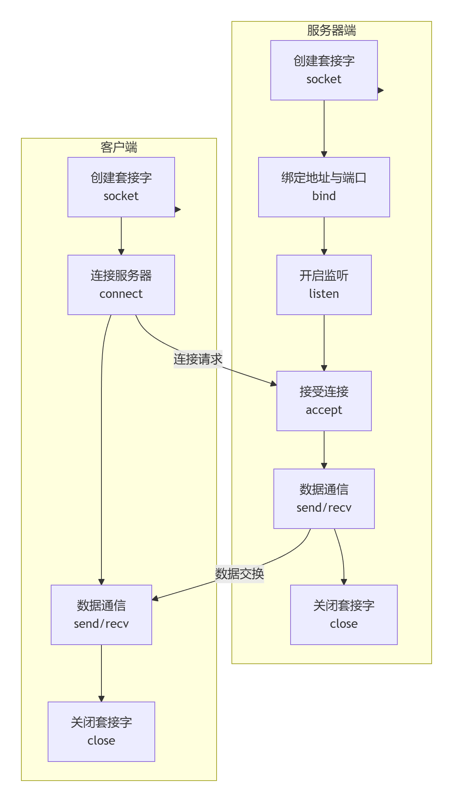

### 在 C++ 中使用TCP sockets进行网络通信的核心步骤：
#### 服务器端
#### 1. 创建socket：调用socket()创建流式套接字，这个套接字用于监听客户端的连接请求，称为监听套接字
```c
#include <sys/socket.h>
int sockfd = socket(AF_INET, SOCK_STREAM, 0);

// socket函数说明：
// 函数原型：
#include <sys/socket.h>
int socket(int domain, int type, int protocol);

// 返回值：成功时返回一个套接字描述符（非负整数），作为后续操作的句柄。失败时返回-1.并设置全局变量errno指示错误类型
```
- 参数说明：
    - domain（协议族/地族址）：指定套接字使用的协议族，决定了如何解释地址以及通信的网络范围
        - AF_INET:IPv4协议
        - AF_INET6:IPv6协议
        - AF_UNIX / AF_LOCAL：Unix 域协议，用于同一台主机上的进程间通信（IPC）

    - type（套接字类型）：定义套接字的通信特性，如数据传输方式。可与标志按位或组合使用，如
        - SOCK_NONBLOCK（非阻塞模式）和 SOCK_CLOEXEC（执行时关闭）
        - SOCK_STREAM：面向连接的字节流套接字，保证数据顺序及可靠性，对应 TCP
        - SOCK_DGRAM：无连接的数据报套接字，不保证顺序和可靠性，对应 UDP
        - SOCK_RAW：原始套接字，允许对底层协议（如 IP 或 ICMP）进行直接访问，特权

    - protocol（具体协议）：通常设置为 0，表示根据 domain和 type自动选择默认协议（如 SOCK_STREAM默认 TCP，SOCK_DGRAM默认 UDP）。也可显式指定，如 IPPROTO_TCP、IPPROTO_UDP或 IPPROTO_ICMP（用于原始套接字）

#### 2. 绑定地址：通过bind()将 socket 与 IP 地址和端口绑定。
```c
struct sockaddr_in serv_addr;
serv_addr.sin_family = AF_INET;
serv_addr.sin_addr.s_addr = htonl(INADDR_ANY); // 绑定本机所有IP
serv_addr.sin_port = htons(8080); // 绑定端口8080
bind(sockfd, (struct sockaddr*)&serv_addr, sizeof(serv_addr));

// htonl函数：host to​ network long，意为将主机的长整型（32位）数据转换为网络字节序，用于消除不同主机字节序的差异，确保数据在不同系统间正确解读
// htons函数：host to​ network short

// bind函数原型：
#include <sys/socket.h>
int bind(int sockfd, const struct sockaddr *addr, socklen_t addrlen);

// 返回值：成功时返回 0，失败时返回 -1并设置 errno
```
- 参数说明
    - sockfd：由 socket()函数返回的套接字描述符

    - addr：指向 sockaddr 结构体的指针，包含要绑定的地址和端口信息。实际常用的是 sockaddr_in（IPv4）或 sockaddr_in6（IPv6）等特定结构体，使用时需强制转换为 sockaddr *。
    ```c
    struct sockaddr_in {
        sa_family_t    sin_family; // 地址族，如 AF_INET
        in_port_t      sin_port;   // 端口号（网络字节序，使用 htons() 转换）
        struct in_addr sin_addr;   // IP 地址
    };
    struct in_addr {
        uint32_t s_addr;           // 地址（网络字节序，使用 inet_addr） 
    };
    ```

    - addrlen：addr所指向结构体的长度，通常使用 sizeof()计算

#### 3. 监听连接：使用listen()开启监听，设置最大连接队列
```c
listen(sockfd, 5);

// 函数原型：
#include <sys/socket.h>
int listen(int sockfd, int backlog);

// 返回值：成功时返回 0，失败时返回 -1并设置 errno
```
- 参数说明
    - sockfd：已由 socket()创建并成功通过 bind()绑定到本地地址的套接字描述符
    - backlog：定义内核为此套接字维护的已完成连接队列（已完成三次握手）的最大长度。当队列满时，新的连接请求可能会被拒绝，客户端收到错误。某些系统也允许此参数影响未完成连接队列（未完成三次握手）的大小。可将此参数设置为 SOMAXCONN，让系统自动选择一个合理的较大值

#### 4. 接受连接：调用accept()阻塞等待客户端连接，返回新的 socket 用于通信。
```c
struct sockaddr_in client_addr;
socklen_t client_len = sizeof(client_addr);
int new_sockfd = accept(sockfd, (struct sockaddr*)&client_addr, &client_len); // new_sockfd用于与此客户端通信

// accept函数原型：
#include <sys/socket.h>
int accept(int sockfd, struct sockaddr *addr, socklen_t *addrlen);

// 返回值：成功时返回一个新的套接字描述符（非负整数），该描述符专门用于与本次接受的客户端进行通信。失败时返回 -1并设置 errno

//参数说明：
sockfd：正处于监听状态（已调用 listen()）的服务器端套接字描述符（监听套接字）
addr：（可选）指向 sockaddr 结构体的指针，用于存储发起连接请求的客户端的协议地址（IP 地址和端口号）。如果不需要客户端地址，可设为 NULL
addrlen：（输入输出参数）调用时指定 addr指向缓冲区的长度；返回时被设置为客户端地址的实际长度。如果 addr为 NULL，此参数也应设为 NULL
```
#### 5. 数据收发：使用send()和recv()进行数据传输。
```c
// 发送数据
send(sockfd, buffer, data_len, 0);

// 接收数据
recv(sockfd, buffer, buffer_size, 0);

// send、recv函数原型：
#include <sys/socket.h>
ssize_t send(int sockfd, const void *buf, size_t len, int flags);
ssize_t recv(int sockfd, void *buf, size_t len, int flags);

// 返回值：成功时返回实际发送/接收的字节数；失败返回 -1并设置 errno。返回值可能小于 len，特别是在非阻塞模式下，此时必须循环调用send\recv函数（需要重新计算发送起始地址和长度）
```
- 参数说明
    - `sockfd`：已连接的套接字描述符，即accept返回的套接字描述符
    - `buf`：指向待发送数据/存放接收数据的缓冲区
    - `len`：期望发送/接收的数据字节数
    - `flags`：控制发送行为的位标志。
    - send常见flags：
        - `MSG_CONFIRM`​ (UDP)：提示内核确认数据包可达
        - `MSG_DONTWAIT`：非阻塞操作。即使缓冲区已满/空，也立即返回，不阻塞进程。设置错误码为 EAGAIN或 EWOULDBLOCK。
        - `MSG_MORE`：提示内核后续还有数据要发送，有助于合并小包，提升效率（TCP/UDP）
        - `MSG_NOSIGNAL`​ (Linux)：防止向进程发送 SIGPIPE信号（当向已关闭的连接写入数据时）。应使用此标志或忽略 SIGPIPE信号以提高程序健壮性。如果不设置此选项，则默认会在发送数据时检查连接状态，如果连接已关闭则会发送 SIGPIPE 信号导致程序终止
        - `MSG_OOB`：发送/接收带外数据（高优先级数据，如紧急指针）

    - recv常用flags：
        - `MSG_DONTWAIT`：同上，用于接收
        - `MSG_WAITALL`：要求函数阻塞，直到收满请求的 len字节数据后才返回
        - `MSG_OOB`：同上，用于接收带外数据

**非阻塞I/O下失败后的行为**：
非阻塞I/O在失败时，系统不会将该进程挂起，而是继续执行，此时若向重试失败的I/O操作，有两种方法：  
1. 循环重试，直至成功为止，这样会白白消耗CPU资源，效率极低
2. 等待通知，等待一个明确的信号，告诉套接字已经准备好重新I/O，这个等待和通知机制的实现就是I/O多路复用技术提供的


#### 6. 关闭 socket：通信结束后关闭连接。
```c
close()(Linux)
closesocket()(Windows) 
shutdown(sockfd,SHUT_RDWR/SHUT_RD/SHUT_WR)
```
- shutdown
    - 实现半关闭状态，只断开连接，**不释放socket描述符**
    - **不影响引用计数**
    - SHUT_RD==0 SHUT_WR==1 SHUT_RDWR==2，SHUT_RD关闭读，后续尝试读操作会返回EOF，**接收缓冲区中未读的数据会被丢弃，新到达的数据会被确认后丢弃**
- close
    - 释放资源，释放描述符
    - 影响引用计数，需要避免父进程close但子进程仍然持有套接字导致的死锁

**关闭socket标准流程**：
1. 调用shutdown关闭写端
2. 对端收到FIN后，读取到read返回0，即将接收缓冲区中的所有数据读取完，可以继续发送数据
3. 本地端继续读取，直到收到对方的FIN
4. 最后调用close释放资源

#### 客户端额外操作
#### 7. 发起连接
```c
struct sockaddr_in serv_addr;
serv_addr.sin_family = AF_INET;
serv_addr.sin_port = htons(8080);
inet_pton(AF_INET, "127.0.0.1", &serv_addr.sin_addr); // 将字符串IP转换为二进制形式
connect(sockfd, (struct sockaddr*)&serv_addr, sizeof(serv_addr));
```

 


### 补充
#### 先创建socket后动态的将其设置为非阻塞模式的方法：
fcntl函数：
fcntl函数是 Unix/Linux 系统中用于**对已打开的文件描述符进行各种控制操作**的重要系统调用。它的功能非常灵活，其原型根据控制命令 cmd的不同，有三种主要形式 :
```c
#include <unistd.h>
#include <fcntl.h>

int fcntl(int fd, int cmd);
int fcntl(int fd, int cmd, long arg);
int fcntl(int fd, int cmd, struct flock *lock);
```
- 参数说明：
    - fd：需要操作的文件描述符，**必须是一个已经打开的**文件、套接字(socket)或其他类型文件描述符

    - cmd：控制命令，指定要执行的操作类型：
        - 复制文件描述符：F_DUPFD, F_DUPFD_CLOEXEC。用于复制一个现有的文件描述符
        - 获取/设置文件描述符标志：F_GETFD, F_SETFD。主要用于管理 FD_CLOEXEC标志，该标志决定了在执行 exec系列函数时是否自动关闭此文件描述符
        - 获取/设置文件状态标志：F_GETFL, F_SETFL。这是非常常用的功能，可以获取或修改文件描述符的状态标志，例如设置非阻塞模式 (O_NONBLOCK)、追加模式 (O_APPEND) 等
        - 获取/设置异步I/O所有权：F_GETOWN, F_SETOWN。用于指定接收 SIGIO和 SIGURG信号的进程或进程组 
        - 获取/设置记录锁：F_GETLK, F_SETLK, F_SETLKW。用于对文件的一部分区域进行加锁（记录锁），以协调多个进程对同一文件的访问 
    - 第三个参数的类型和必要性由cmd决定：
        - 对于F_SETFL等命令，它是一个 long类型的整数值 arg，代表新的标志位 
        - 对于 F_SETLK等记录锁操作，它是一个指向 struct flock结构的指针 lock，该结构详细描述了锁的类型（读/写）、锁定区域等信息
        - 对于 F_GETFL等命令，可能不需要此参数，或使用 0
```c
#include <sys/socket.h>
#include <fcntl.h>
#include <unistd.h>

// 1. 创建socket（默认是阻塞的）
int sock_fd = socket(AF_INET, SOCK_STREAM, 0);
if (sock_fd == -1) {
    perror("socket creation failed");
    exit(EXIT_FAILURE);
}

// 2. 获取当前文件状态标志
int old_flags = fcntl(sock_fd, F_GETFL, 0);
if (old_flags == -1) {
    perror("fcntl F_GETFL failed");
    close(sock_fd);
    exit(EXIT_FAILURE);
}

// 3. 设置新的标志（添加非阻塞属性）
int new_flags = old_flags | O_NONBLOCK;
if (fcntl(sock_fd, F_SETFL, new_flags) == -1) {
    perror("fcntl F_SETFL failed");
    close(sock_fd);
    exit(EXIT_FAILURE);
}
// 此时sock_fd已变为非阻塞模式
```

#### 为阻塞socket设置等待超时时间
使用setsockopt()方法，**不改变socket的阻塞属性**，而是为特定的操作上了一道“保险”。它适用于那些你愿意等待一小段时间，但绝不能无限期等待的场景。
```c
#include <sys/socket.h>
#include <sys/time.h>

int set_socket_timeout(int sockfd, int timeout_seconds) {
    struct timeval timeout;
    timeout.tv_sec = timeout_seconds;
    timeout.tv_usec = 0;

    // 设置接收超时
    if (setsockopt(sockfd, SOL_SOCKET, SO_RCVTIMEO, &timeout, sizeof(timeout)) < 0) {
        return -1;
    }
    // 设置发送超时 (可选)
    if (setsockopt(sockfd, SOL_SOCKET, SO_SNDTIMEO, &timeout, sizeof(timeout)) < 0) {
        return -1;
    }
    return 0;
}
```

